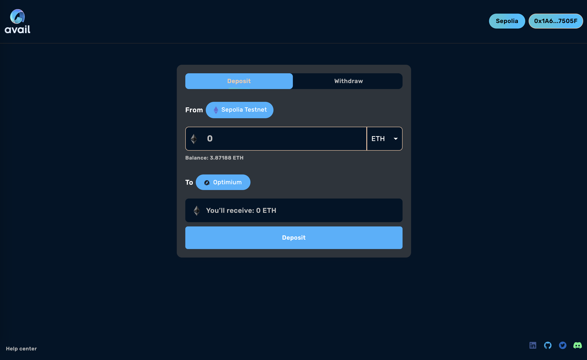
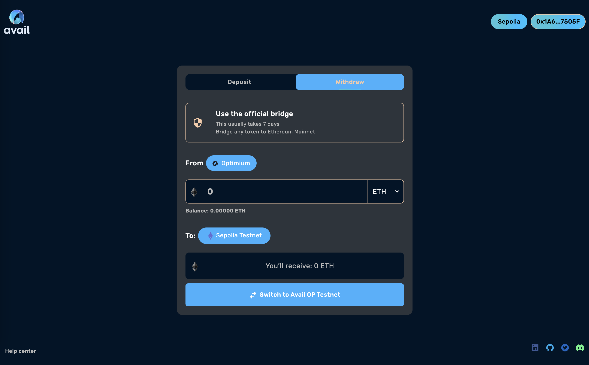
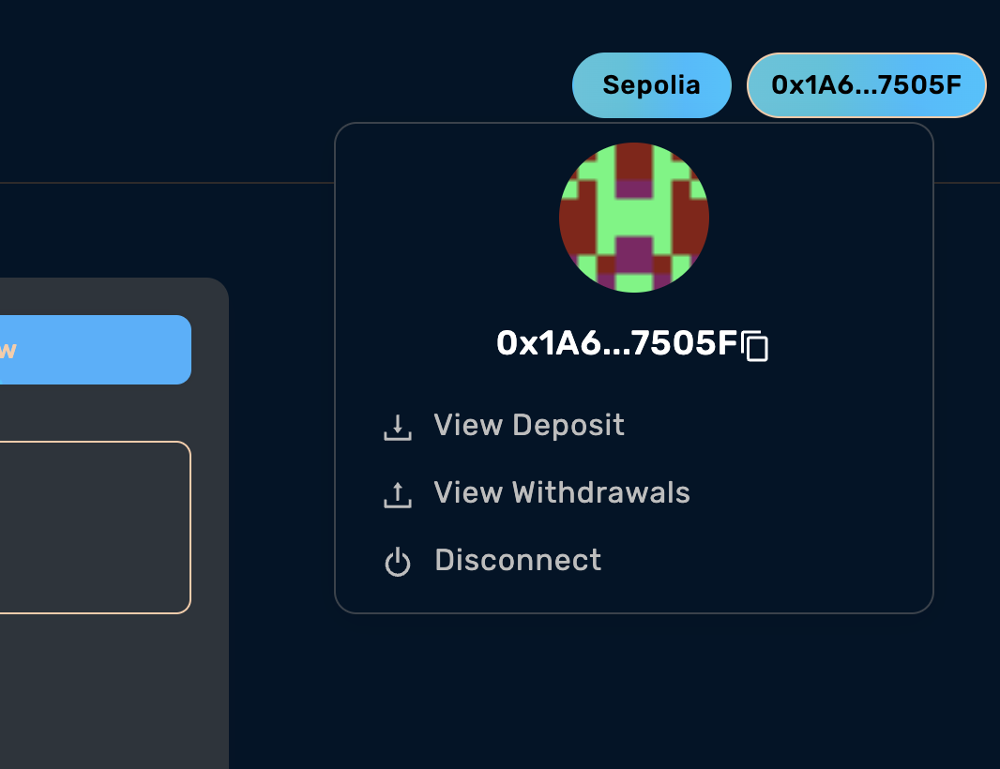

# @op-stack/bridge

The `op-Bridge` is a service for op-stack chains which provides a functional UI for the Bridging between L1 and L2.

## Installation

Clone this repo

```
git clone https://github.com/RISHABHAGRAWALZRA/avail-op-stack-bridge.git

yarn 
```

## Running the service

Copy `.env.example` into a new file named `.env`, then set the environment variables listed there.

Once your environment variables or flags have been set, run the service via:

```
yarn start
```

## What this service does

The `op-bridge` uses the @eth-optimism/sdk <https://sdk.optimism.io/> to provide the bridgining functionality by using CrossChainMessenger. It provides the Deposit and withdraw functionality.

## Tutorial

### Deposits

The Deposit process is an easy one step process which Bridges the Assets from L1(Sepolia) to L2 layer.

- go the the deposit page, choose your asset and initiate the deposit process.

<div align="center">
  <br />
  <br />
  <a href="https://github.com/availproject/avail-op-stack-bridge"></a>
  <br />
</div>

### Withdrawal

Withdrawal is an three step process

  1. Initiate withdrawal on L2
  2. Prove withdrawal on L1 (availale after state root is published, usually takes 25-50 mins to change the status)
  3. Caim the Withdrawal on L1 (available after challenge period is over)

--------------------------------------------------------------------------------------------------

- Initiate the withdrawal on L2

<div align="center">
  <br />
  <br />
  <a href="https://github.com/availproject/avail-op-stack-bridge"></a>
  <br />
</div>

- View your withdrawals from Account section -

<div align="center">
  <br />
  <br />
  <a href="https://github.com/availproject/avail-op-stack-bridge"></a>
  <br />
</div>

- You will see that your withdrwal status is `Waiting for Confirmation` which means your state root is not published yet


- After your state root is published you can see the status change to `Prove` Buttom

- After proving your Transaction on L1 by clicking on prove button the status will change to `In challenge Period`

- When the Challenge period is complete the Status will change to `Claim`

  

- After you Claim the Withdrawal on L1 the withdrawal process is fully completed.

**NOTE - Refresh the page to see the status changes**
